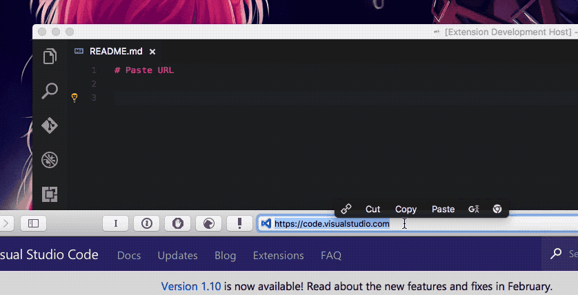

# PasteURL

`PasteURL` is a simple extension that generating markdown-style link when pasting URL.

## Features

When pasting, automatically converting URL to markdown style link.

For example, you have the below URL in your clipboard:

    https://code.visualstudio.com

When pasting with `Paste URL`, you will get

    [Visual Studio Code - Code Editing. Redefined](https://code.visualstudio.com)

One gif is worth a thousand words.



## Usage

- Hit `"Control + Alt + P"` (Recommended)
- Hit `"Command + Shift + P"` and then type `Paste URL` and hit enter.

Selection will be used as the title if possible.

You can change the default shortcut to whatever you like by editing the `Code > Preferences > Keyboard Shortcuts`    (`File > Preferences > Keyboard Shortcuts` on Windows):

```json
[
    {"key": "ctrl+alt+p", "command": "extension.pasteURL"}
]
```

## Known Issues

- Fetching title from some URLs may take longer than expected.

## Source

[GitHub](https://github.com/kukushi/PasteURL)

## License

[MIT](https://github.com/kukushi/PasteURL/blob/master/LICENSE)